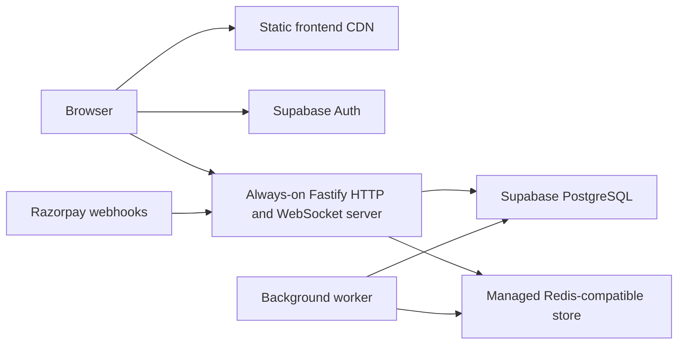

# Bullwave Games backend design

Status: implementation specification, September 9, 2026. This document describes the target system; it does not assert that integration, hosting, or performance testing is complete.

## Decisions

Keep Supabase Auth and extend the existing TypeScript/Fastify backend. Complete frontend integration is included. Launch capacity is 100 simultaneous players, with a US$50–100 monthly infrastructure budget and a global audience. Use one primary region initially, Singapore by default, with CDN delivery for static assets. This is a latency compromise until real player geography is available.

Use a modular monolith: route handlers validate requests, services enforce business rules, repositories own SQL, and infrastructure adapters wrap Redis, Supabase, email, and Razorpay. Retain the current game engines and endpoint prefixes. Avoid an unnecessary framework rewrite.

## Deployment topology

Use a Render paid web service initially sized at 1 CPU and 2 GB RAM, Render Key Value, and Supabase Pro for Auth and PostgreSQL. Place all three in Singapore; configure TLS to Supabase because it is outside Render's private network. Serve the frontend on a static CDN under the main domain and the API under api.bullwavegames.com. Use an API connection pool capped initially at 10 and worker pool at 3. Use the Supabase session pooler when direct connectivity is unavailable.

Reserve about $25 for Supabase and $25–65 for API, Redis, and a small worker, with the remaining allowance for usage. These are budgeting allocations, not a provider quote; confirm the selected compute, bandwidth, email, and tax total before provisioning. Keep production services always on. No multi-region game servers or automatic horizontal scaling at launch.

Run compiled JavaScript in production. Add build/typecheck scripts and a container build that includes shared game modules and SQL migrations. Bind to 0.0.0.0 and the platform PORT. Run migrations once as a release task under a database advisory lock; never migrate and seed every time the API starts. Seed catalog data explicitly without overwriting admin changes.

## Identity and data ownership

- Supabase owns passwords, login, verification, refresh, and password recovery. Disable custom backend authentication routes after frontend cutover; never run two login systems for the same account.
- Verify bearer tokens using Supabase's cached JWKS, checking issuer, audience, expiration, and subject. Use supported remote verification for legacy symmetric signing keys. Never use user-editable metadata to grant admin rights.
- Preserve public.profiles as the profile and role authority. Keep backend users as the application identity referenced by existing foreign keys, adding a unique supabase_user_id. Provision the mapping transactionally on the first verified request. New users receive player permissions. Read role and deletion status from authoritative database records for protected actions.
- Move application tables into a private application schema in the same Supabase database, using a dedicated restricted runtime database role. Browser access to memberships, billing, scores, audit logs, and application users is prohibited. Profile RLS must allow only permitted profile fields to be edited; role updates remain an operations-only action.
- Remove the requirement for a local password hash on Supabase identities. Preserve legacy rows and dependent data during migration. Do not link accounts automatically by email: use an explicit reviewed identity mapping for existing backend accounts. Keep unique constraints and verify foreign-key counts before and after migration.
- PostgreSQL is authoritative for memberships, invoices, orders, accepted scores, saves, cosmetics, friendships, support tickets, catalog, and admin audit records. Redis stores active rooms, rate limits, and rebuildable leaderboard caches.
- Account deletion requires recent Supabase reauthentication, disables application access, and uses a retryable job for Supabase deletion and application anonymization. Retain billing records under the configured retention policy rather than cascading away invoices.

## Modules and frontend contracts

Organize modules as identity/profile, catalog, membership/billing, play/progress, leaderboards, rooms, social/challenges, support, and administration. Each module has routes, request/response schemas, service logic, and repository operations. Keep infrastructure and workers separate from domain rules. Share browser-safe DTOs, never database rows or secrets.

| Interface | Required behavior |
| --- | --- |
| GET/PATCH /api/me | Verified Supabase identity, profile and server entitlement; reject role changes |
| GET /api/games and /api/plans | Published catalog and server prices with explicit camelCase DTOs |
| POST /api/play/:slug/start and /score | Server entitlement/allowance checks; one score submission per bound session |
| GET/PUT /api/play/:slug/save | User-owned validated save payloads |
| GET /api/me/progress | Bests, saves, achievements, owned and equipped cosmetics |
| PUT /api/me/cosmetics/equipped | Equip only server-owned cosmetics |
| /api/billing/* | Server-created checkout, order polling, invoices and cancellation |
| /api/leaderboards/:slug | Bounded pagination; global/friends authorization and score direction |
| /api/friends, /api/challenges/* | Persist existing social features; daily challenge results use accepted play sessions |
| /api/support/tickets and /api/admin/* | Durable support submissions and authorized, audited administration |
| POST /api/rooms/ticket | Short-lived, one-use WebSocket ticket bound to user or server-issued guest identity |
| WSS /rooms | Authenticate with ticket as the first message within five seconds; preserve existing game commands |

Use the existing { ok, ...payload } success envelope and { ok: false, error, code } errors. Add request IDs. Return ISO timestamps, integer paise for payment amounts, and MembershipStatus past_due plus graceEnd. Schema validation and DTO adapters must cover all current games, including collection games absent from the backend seed.

Add one typed frontend API client with configured VITE_API_URL and VITE_ROOMS_URL. Attach the current Supabase bearer token, include credentials for guest cookies, enforce request timeouts, and retry an expired session once after refresh. Do not blindly retry mutations: billing creation and score submission need idempotency identifiers. Abort obsolete loads on logout or account changes.

Replace AppState local mutations with awaited API operations and update every consuming page to show pending, success, and failure states. Load authoritative account state after login and refresh it after mutations. Persist only device preferences and explicitly unranked guest practice locally. Never restore memberships, paid cosmetics, admin grants, invoices, or ranked scores from localStorage. Offer a one-time validated save import; disallow arbitrary cosmetic import.

Checkout must use the provider's actual subscription checkout contract and associate verification with the authenticated user's stored order/subscription. Verify raw webhook signatures, persist incoming events durably, and process them idempotently in a transaction. Duplicate and out-of-order events must not grant twice or regress a newer paid period. Display pending until the server confirms payment. Disable development fulfillment in production at both configuration and route registration.

## Performance and room correctness

- Eliminate one SQL user lookup per leaderboard row: fetch names in one query. Include page, page size, game, and user in friends-board cache keys; invalidate on friendship and score changes. Respect higher-better and lower-better rules in SQL and Redis. Publish outbox updates monotonically so delayed work cannot replace a better score.
- Cache published catalog/plans for 60 seconds with explicit invalidation on admin edits. Never CDN-cache personalized API responses. Add indexes based on actual filters and query plans, especially personal bests, user orders, pending outbox rows, and memberships nearing expiry.
- Replace Redis KEYS scans every 250 ms with a sorted set of room deadlines and bounded due-room processing. Route joins, actions, disconnects, and timeouts through a per-room serialized queue. Launch with exactly one room-owning API process; Redis pub/sub alone does not make concurrent state mutation safe.
- Include monotonic room versions and client action IDs. Reject duplicate actions, send one state broadcast per accepted action, bound outgoing buffers, and disconnect slow consumers. Rate-limit connections and messages; validate Origin and message schemas. Keep hidden game data filtered per player.
- Add 30-second reconnect reservations with an opaque hashed resume credential bound to the seat and identity. Resume sends a complete current state. Persist completed room snapshots idempotently through a durable outbox before expiring live room data. If Redis state is lost, mark affected games interrupted rather than fabricating a result.
- Run durable jobs in a separate small worker: webhook processing, leaderboard outbox, membership expiry, notifications, and snapshots. Claim database work with SKIP LOCKED, bounded batches, retry/backoff and dead-letter visibility. Prevent overlapping periodic jobs. Keep room deadlines in the owning API process.
- Redis failures must not erase accepted PostgreSQL scores. Fall back to bounded SQL leaderboard reads; temporarily reject room actions when authoritative live state is unavailable. Database failures fail readiness and return clear retryable errors.

Before adding API replicas, introduce explicit room ownership with fenced leases or sharded room workers and test ownership transfer. Scale based on measured latency, queue depth and memory rather than registered account count.

## Operations and acceptance

Provide /health/live for process liveness and /health/ready for bounded database/Redis checks. Handle SIGTERM by stopping new work, closing sockets with a reconnect reason, draining in-flight requests and closing pools. Validate production secrets and URLs at startup. Restrict trusted proxies, use exact CORS origins and secure guest cookies, and redact tokens and payment payloads from logs.

Track HTTP p50/p95/p99 latency, error rate, database pool waits, event-loop lag, connected sockets, room action latency, outbox age, and webhook failures. Alert on sustained API errors above 1%, five-minute p95 above 300 ms, or outbox age above 60 seconds. Enable database backups and rehearse restore to a separate environment; document the actual recovery point and time measured. A single API instance is not a high-availability deployment.

Performance gates are targets to prove, not guarantees: with a same-region load generator, 100 connected players across 25 rooms plus 20 HTTP requests/second for 30 minutes, target API p95 under 200 ms and room action-to-broadcast p95 under 100 ms, excluding external payment/Auth calls. Require under 1% unexpected errors, no lost/duplicate state transitions, and no growing memory or work backlog. Measure browser latency separately from Asia, Europe and North America; a CDN does not eliminate round-trip time to the game server.

Tests must cover:

1. Supabase valid/expired/wrong-issuer tokens, key rotation, profile provisioning races, player/admin boundaries, account deletion and cross-user data access.
2. Membership enforcement, signed subscription callbacks, webhook replay/reordering, failed renewals and grace expiry; no browser-side activation.
3. Score replay and concurrent submit, invalid durations/scores, guest unranked behavior, save ownership, cosmetics ownership and local import restrictions.
4. Leaderboard pagination, ties, both score directions, friends cache invalidation, Redis failure and outbox recovery.
5. Simultaneous room joins/actions/timeouts, reconnect, slow clients, restart, hidden-state filtering and exactly-once final snapshots.
6. Browser flows for signup, verification, onboarding, checkout, gameplay, reload/cross-device progress, support and admin changes; existing game regression tests and both TypeScript builds.

Implement in order: database/identity migration; typed contracts and API client; account/catalog integration; billing; play/progress/social/admin integration; room correctness; performance fixes and workers; deployment configuration and staging validation. Each step must include its integration tests before proceeding. Release only after staging passes; use additive migrations and retain the previous compatible build for rollback. Provisioning requires the actual Supabase/Render projects, domain access, and Razorpay configuration, none of which were verified during this design task.

## Provider references

- Supabase JWT verification: https://supabase.com/docs/guides/auth/signing-keys
- Supabase pricing: https://supabase.com/pricing
- Render regions: https://render.com/docs/regions
- Render WebSockets: https://render.com/docs/websocket
- Render compute and pricing: https://render.com/docs/compute-plans and https://render.com/pricing
